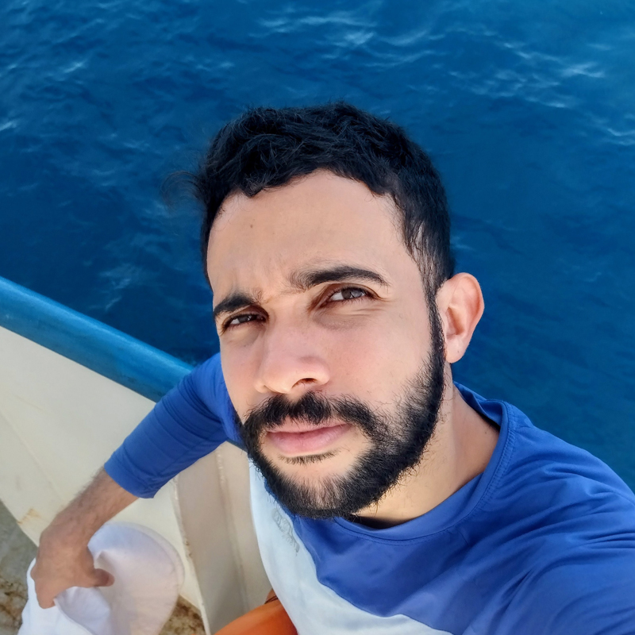

::: {.column-page}
::: {.layout-grid}

::: {.profile-sidebar}
{.profile-image}

# Wesley Neves
[Biólogo • PhD Student • R Developer]{.profile-subtitle}

::: {.profile-social}
<a href="mailto:wesley.neves@ufpe.br" title="Email"><i class="bi bi-envelope-fill"></i></a>
<a href="https://github.com/wesneves" target="_blank" title="GitHub"><i class="bi bi-github"></i></a>
:::
:::

::: {.biography-content}
## Biografia

Dedicado à compreensão da biodiversidade marinha através de lentes quantitativas. Especialista em ecologia de comunidades e modelagem estatística, atuo na interseção entre a oceanografia biológica e a ciência de dados. 

Como instrutor de **Data Science**, foco na democratização de ferramentas computacionais para pesquisadores através do projeto **Universo R** e do curso **Do Dado ao Artigo**.

### <i class="bi bi-mortarboard-fill"></i> Formação Acadêmica

**Doutorado em Oceanografia** (Em andamento)  
*Universidade Federal de Pernambuco* Foco em tipos funcionais de ecossistemas marinhos (MEFT’s) e séries temporais.

**Mestrado em Biologia Animal** 
*Universidade Federal de Pernambuco* Foco sobre o morfodinamismo de praias arenosas e o macrobentos que vivem nesses ambientes.

**Graduação em Ciências Biológicas com Ênfase em Ciências Ambientais** *Universidade Federal de Pernambuco* 

:::

:::
:::